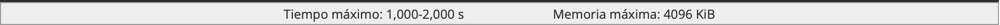
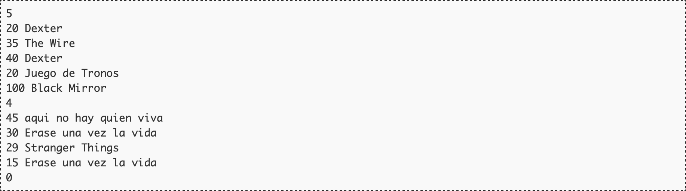
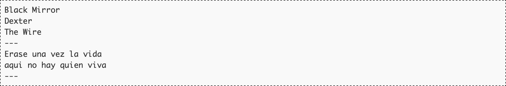

# Las series más vistas

Para las distintas plataformas de streaming de vídeo es muy importante la inversión en marketing necesaria para conseguir un nuevo cliente y el tiempo medio de permanencia de ese cliente. Si los beneficios provocados durante ese periodo de permanencia superan el coste de captación, todo va bien. Si la situación generalizada es la contraria y los clientes abandonan antes de recuperar esa inversión de captación, entonces la plataforma de streaming tiene problemas.

Una de las claves para que los clientes no anulen sus suscripciones es que el contenido que les ofrecen se adecúe a sus gustos. Y para eso es de vital importancia que funcione bien el algoritmo de recomendación que decide qué películas y series se aconsejan al usuario cuando accede. No es de extrañar, pues, que las mejoras en esos recomendadores automáticos sean continuas.

La forma en la que funciona la recomendación de películas y la de series es distinta pues las películas son entidades independientes mientras que en las series no importa tanto los capítulos concretos que se hayan podido ver como el tiempo dedicado a la serie en general.

Para la nueva versión del recomendador, una plataforma está anotando el tiempo que cada usuario ve una serie sin interrupción. Al final de mes, procesarán esa información y generarán un listado ordenado con las series que cada usuario ha visto durante al menos 30 minutos, ya sea en una sentada o en varias. Esa información la utilizarán después para recomendar series cuando el usuario vuelva a conectarse.

## Entrada

La entrada está formada por distintos casos de prueba. Cada caso de prueba comienza con una línea con el número de veces en la que el usuario se ha puesto a ver una serie (entre 1 y 1000). Tras eso aparece una línea por cada una de las sesiones, que comienza con la duración en minutos de la sesión seguida del nombre de la serie. El nombre de la serie está formado por letras en mayúscula y minúscula del alfabeto inglés y espacios, y su longitud nunca es superior a 100 caracteres. Cada sesión no supera nunca los 200 minutos.

La entrada termina con una línea con un cero.

## Salida

Por cada caso de prueba se escribirán las tres primeras series del listado de series ordenadas por minutos de visión del usuario. En caso de empate a minutos se utilizará el orden lexicográfico como método de desempate. Recuerda que en el listado no entran las series que se han visto menos de 30 minutos.

Tras cada caso de prueba aparecerá una línea con tres guiones ("---").

## Entrada de ejemplo

## Salida de ejemplo

## Lenguaje empleado

	

---

[🛜 Aquí puedes encontrar el sitio web oficial donde se encuentra este reto.](https://aceptaelreto.com/pub/problems/v007/00/st/statements/Spanish/index.html)

[^info]: Es una simplificación porque a partir de un punto, los calibres reales ni siquiera son consecutivos.